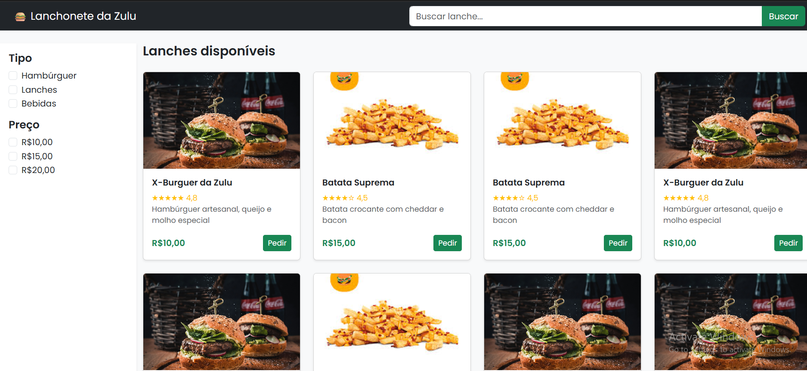

# Lanchonete da Zulu

  

Aplicação web simples para listar lanches e iniciar pedidos.

Sem complexidade desnecessária.  
Funciona, é legível e pode evoluir.

## Stack
- HTML
- CSS
- Bootstrap
- JavaScript

## Estrutura
/
├── index.html
├── assets/foto.png
├── css/
└── js/

shell
Copy code

## Status
Em desenvolvimento.

## Autor
Gabriel Silva Sousa